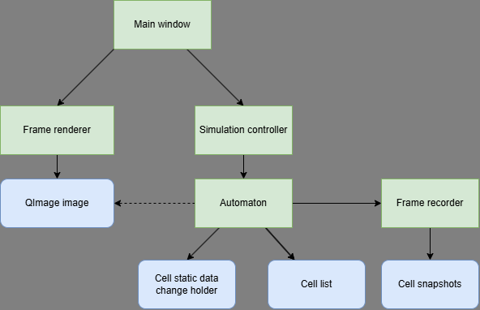
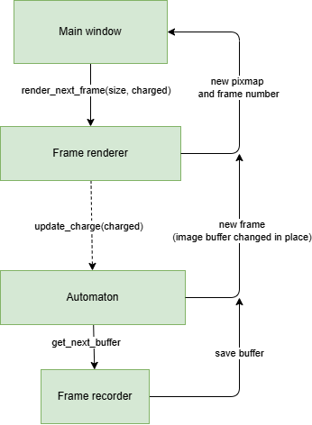
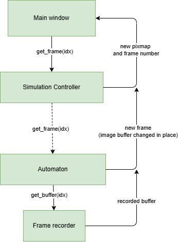

## Problem - GC + Serialization

Pythons garbage collector adds a large overhead for data serialized by the automaton, making rendering and storing snapshots unviable.
My proposed solution is to move data recorder and rendering process to the backend, freeing the code from the need to serialize the automaton data and adding the ability to pre allocate all the needed memory (while keeping it outside of GC scope).

## General explenation
Here are some general explenations for the idea! :>

### Architecture
Functionality implemented in `frame_recorder.py` and `frame_renderer.py` would be moved to the backend. Those classes could be refactored into some kind of proxy.
In general I want to use current automaton (`automaton.pxd`) as the only entry point to the c compiled code, but we can add some kind of proxy that would expose all the needed python API on top of the automaton (though automaton still needs some python objects for the proper initialization).
Frame renderer would pass the reference to `QImage`, stored now as an attribute of the class, to the backend, so that the automaton can draw on it without the need to serialize the data.

Backend would implement recorder module to store the cell snapshots, as well as a renderer module to transform the automaton data into bitmap/simple image so that it can be safely rendered.
Additionally automaton will expose a getter to pull the data of the selected cells from the automaton grid.
Backend should also implement the structure to hold the manual updates to the static cell data.

### General flow in the new version.
On initialization the `main_label` would first create a `frame_renderer`. The `QImage` attribute of the `frame_renderer` can be then passed to the `automaton`, so that it can be
easily modifed on the backend. Additionally, frontend would need to pass the buffer size to the automatons constructor.

Diagram below present proposed object ownership, green labels are classes, blue are relevant class attributes. Continuous arrow represent ownership, dotted line means a borrowed reference.

#### Frame loop

In this version the recording and drawing would take place inside of the automaton instead of the recorder and renderer classes. That means the frame renderer only needs to create a bitmap that is then returned to the front end.
The data flow for a simple frame update would be something like this:

Where dotted line means that a few nested calls are skipped in the diagram.

#### Recoding functionality
Recording is performed by the automaton in each update loop. Frontend should call
specific getter to check how many frames are present in the recorder.
As for displaying recorded frames, this functionality could look like this:

Restoring the automaton state for the specified frame would be similar in process. Frame renderer would need to call a different method (with the same arguments), so that automaton, additionally to drawing the state, would also overwrite its grids with the informations stored in the frame recorder.

### Implementation details

#### CellWrapper
CellWrapper is a cython class that can be safely stored inside of the python dictionary, but holds the pointers to c structs. This means that we can achieve 
the fast lookup for each cell (and serialize it to dict).

| Attribute | Type | Details | 
| :- | :- | :- |
| `cell_a` | `CCell*`| Pointer to cell in grid_a |
| `cell_b` | `CCell*` | Pointer to cell in grid_b |
| `cell_data` | `dict` | Python dict with the cell arguments (or other structure used for this) |
| `neighbors` | `List[Tuple[int, int]]` | List of positions of the neighbors |

This class can implement method like `to_dict` that would return the dictionary build from `cell_a`, so that it can be displayed on the frontend.
It shouldn't provide and deallocation (or at most just set the pointers to NULL) as it doesn't hold an ownership on the cells a and b.

#### CellSnapshot
CellSnapshot is a c struct that holds the dynamic data from the cell.

| Attribute | Type | Details | 
| :- | :- | :- |
| `pos_x` | `int` | X coordinate of the cell |
| `pos_y` | `int` | Y coordinate of the cell |
| `c_state` | `CellStateC` | State of the cell |
| `charge` | `double` | Current charge |
| `timer` | `int` | Current timer value |

#### FrameRecorder
FrameRecorder is an implementation of the circular buffer that holds an array of CellSnapshots and allows to pull the data of the specified frame.

Attributes:
| Attribute | Type | Details | 
| :- | :- | :- |
| `buffer` | `CellSnapshot**` | An array of the arrays with cell snapshots |

Methods:
| Method | Arguments | Returns | Details |
| - | - | - | - |
| `__init__` | `int frame_count`, `int grid_size` | --- | Creates the recorders buffer with the size specified by both arguments |
| `__dealloc__` | --- | --- | Frees the allocated buffer |
| `get_next_buffer` | --- | `CellSnapshot*` | Returns the next free array so that the data can be pushed there |
| `get_buffer` | `int idx` | `CellSnapshot*` | Returns the buffer with the specified frame |
| `remove_newer` | `int idx` | --- | Remove frames after `idx` (move the internal pointer, don't free the data) |
| `remove_older` | `int idx` | --- | Remove frames before `idx` |

#### Frame drawing
Drawing process would use free functions that transform the cell to the target pixel values that can than be assign to the corresponding position in the image data buffer. I'm not sure about the data types, but the functions should look something like:

* `cell_state_to_rgb(CCell* cell) -> int` - Maps cell state to rgb.
* `hsv_to_rgb(int) -> int` - Changes the value from HSV to RGB space.
* `cell_charge_to_rgb(CCell*) -> int` - Uses `hsv_to_rgb` to map the charge to rgb color.

Here I've assumed that pixel is represented by a bit encoded integer.

### Static changes recording
By static change I assume a uniform change of a set of cells. Assuming that the request looks something like `Tuple[List[Tuple[int, int]], Dict]` with the dict being a new set of parameters (assume uniform format of the dict for all cells and changes) the change can be performed by a simple loop that takes the `CellWrapper`s for each position and applies the changes.

To record a single change we can create a following structure:
| Attribute | Type | Details | 
| :- | :- | :- |
| `old_state` | `Dict` | state before the change |
| `new_state` | `Dict` | state after the change |

Let's call that a CellStaticState

Then when applying the change we can retrieve the old state of each cell and create a mapping:
`Dict[frozenset[Tuple[int, int]], CellStaticState]`,
where all keys sum up to the list of positions provided in the first list.
Thanks to this we avoid the problem where cells selected by the user had different data before the change.

Mapping between the new and old state can be performed by a simple nested loop over this hash map.

Now the changes can be stored on a LIFO queue - update applies the old->new mapping and pushes this structure to queue, reverting changes pops the structure and applies the reversed mapping.